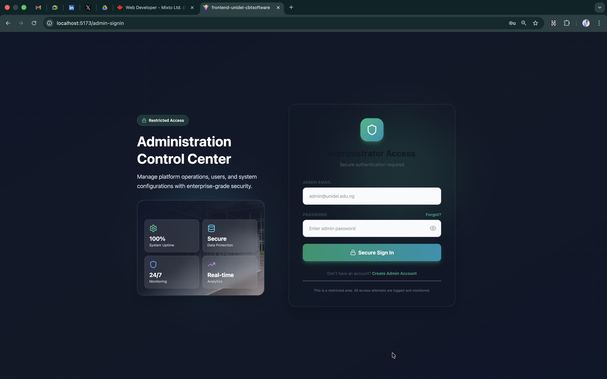
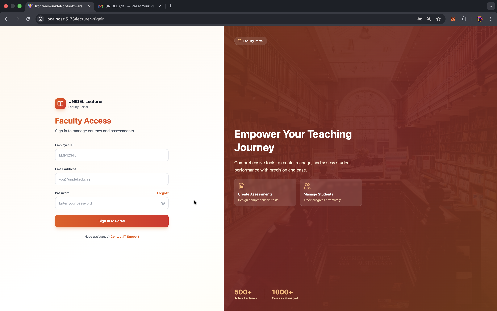
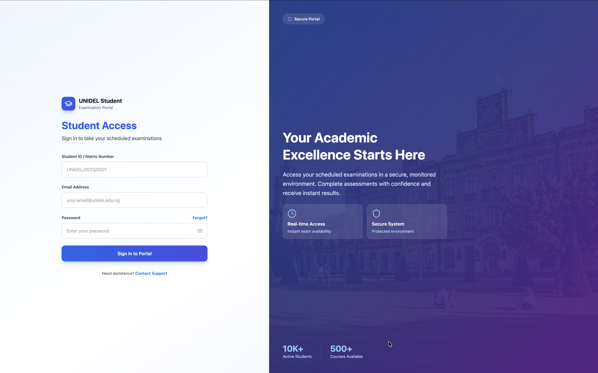
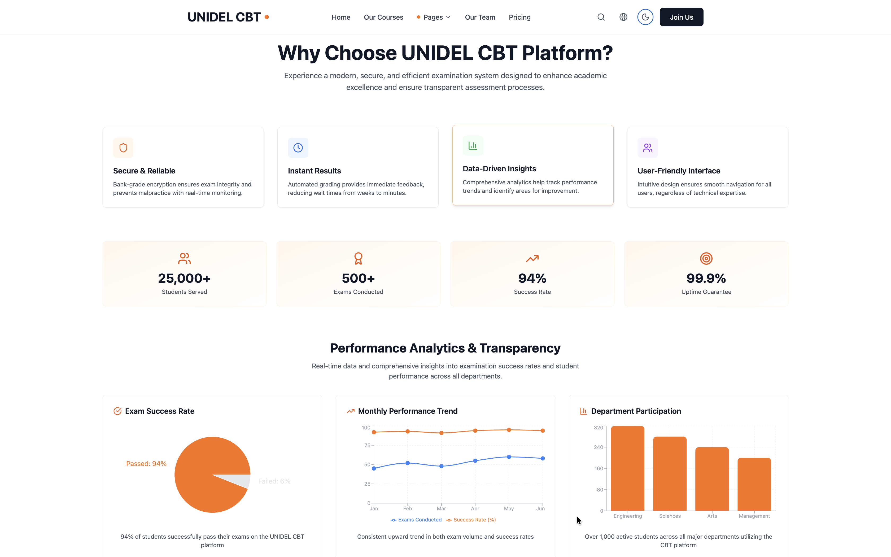
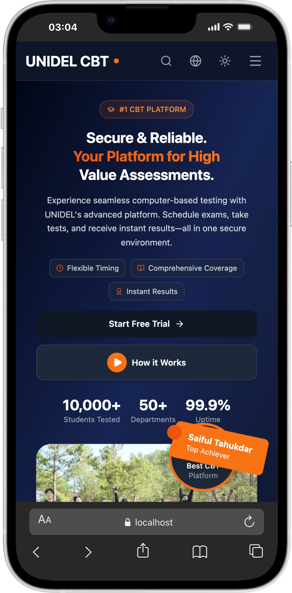
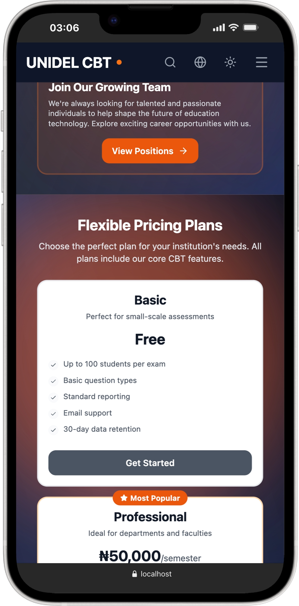
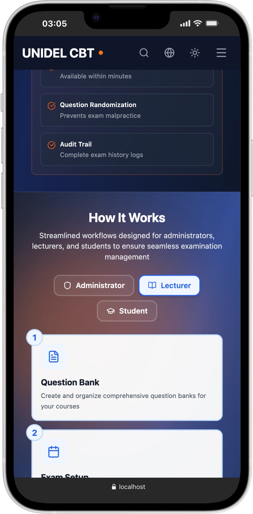
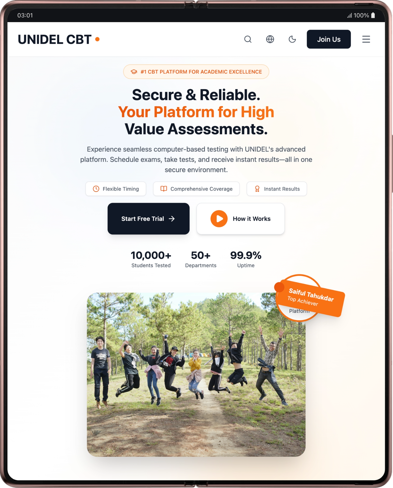
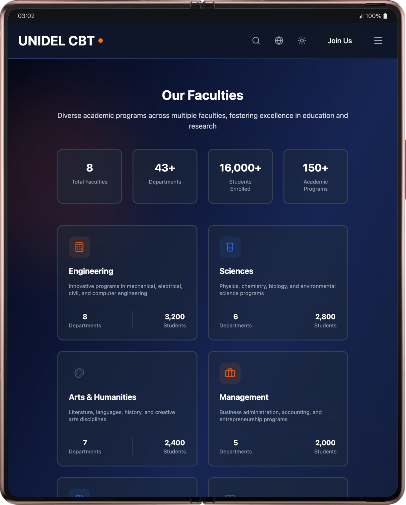

# UNIDEL Computer-Based Test (CBT) System

A comprehensive, enterprise-grade examination management platform built with the MERN stack, designed for universities and educational institutions to conduct secure, fraud-resistant online assessments.

---

## Overview

The UNIDEL CBT System is a full-stack application that revolutionizes the way educational institutions conduct examinations. With advanced security measures, real-time monitoring, and intelligent analytics, it ensures academic integrity while providing a seamless experience for students, lecturers, and administrators.

### Architecture

```
UNIDEL CBT System
├── Backend (Node.js + Express + MongoDB)
│   ├── RESTful API
│   ├── JWT Authentication
│   ├── Real-time Exam Scheduler
│   └── Fraud Detection Flow
│
└── Frontend (React + Vite + TailwindCSS)
    ├── Role-Based Dashboards
    ├── Responsive UI
    ├── Real-time State Management
    └── Client-Side Security Monitoring
```

### UI Images

#### Sign-in Pages (3 images)

| Admin Sign-in                     | Lecturer Sign-in                     | Student Sign-in                     |
|-----------------------------------|--------------------------------------|-------------------------------------|
|      |      |      |

#### Hero & Charts (2 images)

| Landing Hero                          | Analytics Charts                          |
|---------------------------------------|-------------------------------------------|
|   |           |

#### Mobile Views (3 images)

| Mobile Screen 1                        | Mobile Screen 2                        | Mobile Screen 3                        |
|----------------------------------------|----------------------------------------|----------------------------------------|
|         |         |         |

#### Tablet Views (3 images)

| Tablet Screen 1                        | Tablet Screen 2                        | Tablet Screen 3                        |
|----------------------------------------|----------------------------------------|----------------------------------------|
|         |         |         |

---

## Key Features

### **Advanced Authentication & Authorization**

- **Multi-Role System**: Admin, Lecturer, Student with granular permissions
- **JWT Token-Based Auth**: Secure, stateless authentication with HTTP-only cookies
- **First-Login Password Change**: Enforced password reset for new accounts
- **Password Reset Flow**: Secure token-based password recovery via email
- **Auto-Generated Credentials**: System generates unique IDs and passwords for new users
- **Session Management**: Automatic token refresh and secure logout

### 👥 **User Management**

**Admin Capabilities:**
- Create/manage students, lecturers, and other admins
- Auto-generate unique identifiers:
  - Matric Numbers: `UNIDEL/CS/2024/0001`
  - Lecturer IDs: `LEC000001`
  - Employee IDs: `EMP000001`
  - Admin IDs: `ADM000001`
- Department and course assignment
- Bulk user operations
- User statistics and analytics

**Profile Management:**
- File uploads (documents, attachments) via Cloudinary
- Profile updates and password changes
- Role-specific dashboard access

### **Question Bank System**

**Lecturer Features:**
- **Manual Entry**: Create questions with multiple-choice options
- **Bulk Upload**: Import questions from PDF, DOCX, CSV, XLSX files
- **AI-Powered**: Generate questions from text using HuggingFace AI
- **Smart Parsing**: Automatic extraction and formatting of questions
- **Version Control**: Track question bank revisions
- **Image Support**: Add illustrations to questions (AI-generated or uploaded)

**Admin Approval Workflow:**
```
Draft → Submit for Approval → Admin Review → Approved/Rejected → Exam Ready
```

- Review questions before exam creation
- Provide feedback/comments to lecturers
- Track approval history

### **Exam Management**

**Exam Creation:**
- Create exams from approved question banks
- Select specific questions or use entire bank
- Set duration, start time, and end time
- Configure passing percentage

**Automatic Lifecycle Management:**
- `pending` → Scheduled for future (auto-activates at start time)
- `active` → During exam window
- `completed` → After end time (auto-completes)

**Exam Scheduler (Background Job):**
- Runs every minute to check exam status
- Auto-activates exams at start time
- Auto-completes exams at end time
- Sends reminder emails 24 hours before exam
- Sends warning emails 5 minutes before exam ends

### **Real-Time Exam Taking**

**Student Experience:**
- **Fullscreen Mode**: Enforced during exam
- **Server-Synced Timer**: Prevents time manipulation
- **Auto-Save**: Answers saved every 2 seconds (debounced)
- **Question Navigation**: Jump to any question, mark for review
- **Progress Tracking**: Visual indicators for answered/unanswered questions
- **Countdown Warnings**: Visual alerts when time is running low
- **Automatic Submission**: Triggers on time expiry or violations


### **Automated Grading System**

**Instant Grading:**
- Automatic scoring on submission
- Marks comparison with correct answers
- Percentage calculation
- Grade assignment (A-F scale)
- Pass/fail determination

**Grade Distribution:**
| Grade | Percentage |
|-------|-----------|
| A     | 70%+      |
| B     | 60-69%    |
| C     | 50-59%    |
| D     | 45-49%    |
| E     | 40-44%    |
| F     | <40%      |

**Post-Grading:**
- Email notifications to students
- Detailed results with question-by-question breakdown
- Lecturer feedback integration
- Performance analytics

### **Advanced Fraud Detection System**

**Client-Side Monitoring:**
```javascript
// Real-time violation detection
- Tab switching (visibilitychange)
- Window blur (focus loss)
- Fullscreen exit
- Copy/paste attempts
- Right-click blocking
- DevTools detection
- Browser navigation blocking
```

**Violation Severity Levels:**
| Type | Severity | Action |
|------|----------|--------|
| Tab Hidden | High | Record + Warning |
| Window Blur | High | Record + Warning |
| Route Change | Critical | Record + Severe Warning |
| Exit Fullscreen | Medium | Record + Warning |
| Context Menu | Low | Record |
| Copy/Paste | Medium | Block + Record |
| DevTools Open | High | Record + Warning |

**Auto-Submit Logic:**
```javascript
const VIOLATION_THRESHOLD = 3;

// After 3 violations:
- Exam is auto-submitted immediately
- Student receives notification
- Submission is flagged for review
- Violation details logged with metadata
```

**Violation Tracking:**
- Real-time logging to database
- IP address and user agent capture
- Question index at time of violation
- Timestamp precision
- Aggregate violation statistics

### **Comprehensive Analytics Dashboards**

**Admin Dashboard:**
- **System Overview**: Total users, courses, exams, departments
- **User Metrics**: New registrations, active users, growth trends
- **Exam Statistics**: Active, completed, scheduled exams
- **Submission Analytics**: Pass rates, average scores, completion rates
- **Activity Trends**: Login patterns, peak usage hours
- **Department Distribution**: Student/lecturer breakdown by department
- **Fraud Analytics**: 
  - Total violations across system
  - Top 10 violators with details
  - High-risk courses and departments
  - Violation type breakdown
  - Auto-submit statistics

**Lecturer Dashboard:**
- **Course Overview**: Assigned courses, enrolled students
- **Exam Management**: Total, active, pending, completed exams
- **Question Banks**: Draft, pending approval, approved banks
- **Student Performance**: Average scores, pass/fail rates by course
- **Submission Tracking**: Graded vs ungraded submissions
- **Fraud Analytics**:
  - Violations in lecturer's courses
  - Students with violations
  - Exams ranked by violation count
  - Violation type distribution

**Student Dashboard:**
- **Academic Progress**: Enrolled courses, available exams
- **Performance Metrics**: Pass/fail rates, average score, grade trend
- **Submission History**: All attempts with scores and grades
- **Course Performance**: Score breakdown by course
- **Recent Grades**: Latest 5 graded submissions
- **Integrity Report** (if violations exist):
  - Personal violation count
  - Violations by course
  - Violation type breakdown
  - Rank/percentile vs peers (for self-awareness)
  - Tips for maintaining integrity

**Interactive Visualizations:**
- Line charts (performance trends)
- Bar charts (score distribution, violations by type)
- Pie charts (grade distribution, exam status)
- Area charts (activity over time)
- Radar charts (multi-dimensional performance)
- Composed charts (overlays for complex data)

### **Automated Email System**

**Email Templates (Mailgen):**
1. **Account Creation**: Welcome email with credentials
2. **Password Reset**: Secure link for password recovery
3. **Exam Reminder**: 24-hour advance notification with exam details
4. **Exam End Warning**: 5-minute alert before time expires
5. **Submission Confirmation**: Receipt of exam submission
6. **Grade Notification**: Results published alert with score/grade
7. **Password Changed**: Security confirmation after password update

**Email Service Integration:**
- Nodemailer with SMTP support
- Gmail with App Password
- SendGrid integration
- Ethereal test accounts for development
- HTML-formatted emails with branding
- Fallback text version for email clients

### **File Management System**

**Cloudinary Integration:**
- **Document Uploads**: PDF, DOC, DOCX, PPT, XLSX, TXT
- **Image Uploads**: JPG, PNG, GIF, WEBP, SVG
- **Video/Audio**: MP4, AVI, MOV, MP3, WAV
- **Automatic Optimization**: Image compression, format conversion
- **Folder Organization**: Organized by role and user ID
- **Public URL Generation**: Secure, optimized URLs
- **Deletion Management**: Remove files from cloud on delete

**Use Cases:**
- Student documents and attachments
- Course materials (lecturer uploads)
- Profile pictures (future feature)
- Question images/illustrations
- Bulk question file uploads

### **Department & Course Management**

**Department Features:**
- Auto-generated codes: `DPT001`, `DPT002`
- Faculty and level organization
- Head of Department (HOD) assignment
- Student/lecturer assignment to departments
- Course management per department
- Department-wide analytics

**Course Features:**
- Auto-generated course codes: `CS1234`, `ENG5678`
- Multi-department courses
- Lecturer assignment with bidirectional sync
- Student enrollment tracking
- Course materials upload (lecturer-only)
- Material categories: lecture notes, assignments, references

### **Statistics & Reporting**

**Activity Logging:**
- All user actions tracked (login, exam start, submission, etc.)
- IP address and user agent logging
- Timestamp precision
- Entity type tracking (exam, course, user)
- Success/failure status

**Exportable Reports:**
```javascript
// Export options
- Format: JSON, CSV
- Types: Activity logs, submissions, violations
- Period: Today, week, month, year, custom range
- Filters: User, role, action, entity type
```

**System Analytics:**
- Activity by role (students, lecturers, admins)
- Top actions (most common operations)
- Peak usage hours
- System error tracking
- User engagement metrics

### **Security Features**

**Backend Security:**
- **JWT Authentication**: Secure, stateless tokens
- **Password Hashing**: Bcrypt with 10 salt rounds
- **CORS Configuration**: Whitelisted frontend origin
- **Rate Limiting**: Optional global and route-specific limiters
- **Input Validation**: Mongoose schema validation
- **SQL Injection Prevention**: MongoDB parameterized queries
- **XSS Protection**: Sanitized inputs and outputs

**Frontend Security:**
- **Client-Side Validation**: Form validation before submission
- **Token Management**: Secure storage in HTTP-only cookies
- **Auto-Logout**: On token expiration or manual logout
- **Protected Routes**: Role-based route guards
- **CSRF Protection**: Token-based request validation

**Fraud Detection:**
- Real-time violation monitoring
- Three-strike auto-submit policy
- Violation metadata logging (IP, user agent, question index)
- Admin/lecturer review dashboard
- Student self-awareness metrics

### **Frontend Technology Stack**

**Core Libraries:**
- **React 18**: Latest React with concurrent features
- **Vite**: Lightning-fast build tool and HMR
- **React Router v7**: Client-side routing with nested routes
- **TailwindCSS**: Utility-first CSS framework

**State Management:**
- **Zustand**: Lightweight, performant state management
- **React Query (@tanstack/react-query)**: 
  - Server state caching
  - Automatic refetching
  - Optimistic updates
  - Background synchronization
  - Infinite queries

**Performance Optimization:**
```javascript
// Debounce for auto-save (reduces API calls)
import { debounce } from 'lodash';
const debouncedSave = debounce(saveAnswer, 2000);

// Throttle for scroll/resize events
import { throttle } from 'lodash';
const throttledResize = throttle(handleResize, 300);
```

**UI/UX Libraries:**
- **Framer Motion**: Smooth animations and transitions
- **Lucide React**: Modern, customizable icons (468+ icons)
- **Recharts**: Beautiful, responsive charts
- **React Loading Skeleton**: Elegant loading states
- **React Toastify**: Toast notifications

**Date & Time:**
- **Day.js**: Lightweight date manipulation (2KB)
- Timezone support
- UTC handling
- Relative time formatting

**HTTP Client:**
- **React-Query**: Promise-based HTTP requests with interceptors

### **Backend Technology Stack**

**Core Framework:**
- **Node.js 18+**: JavaScript runtime
- **Express.js**: Web application framework
- **MongoDB**: NoSQL database with Mongoose ODM

**Authentication & Security:**
- **jsonwebtoken**: JWT token generation/verification
- **bcryptjs**: Password hashing
- **cookie-parser**: Cookie parsing middleware
- **cors**: Cross-origin resource sharing

**File Processing:**
- **multer**: Multipart/form-data handling
- **cloudinary**: Cloud file storage and optimization
- **pdf-lib**: PDF generation and manipulation
- **pdfjs-dist**: PDF text extraction
- **mammoth**: DOCX text extraction

**Email & Utilities:**
- **nodemailer**: Email sending
- **mailgen**: HTML email template generation
- **dayjs**: Date/time manipulation
- **dotenv**: Environment variable management

**AI Integration:**
- **HuggingFace API**: AI-powered question generation and image creation

**Background Jobs:**
- Custom cron-like scheduler for exam lifecycle management

---

## Quick Start

### Prerequisites

- Node.js 18+ and npm
- MongoDB 5.0+
- Cloudinary account
- Email service (Gmail/SendGrid)

### Installation

```bash
# Clone repository
git clone https://github.com/unawarexi/Mern-Unidel-CBTsoftware.git
cd Mern-Unidel-CBTsoftware

# Install backend dependencies
cd Backend-Unidel-CBTsoftware
npm install
cp .env.example .env
# Edit .env with your credentials
npm run dev

# Install frontend dependencies (new terminal)
cd ../Frontend-Unidel-CBTsoftware
npm install
cp .env.example .env
# Edit .env with backend URL
npm run dev
```

**Backend**: http://localhost:3000  
**Frontend**: http://localhost:5173

### Default Admin Account

```
route: http://localhost:5173/admin-signin
Email: unawarexi@gmail.com
Password: Admin@2024
```

---

## 📚 Documentation

- [Backend README](./Backend-Unidel-CBTsoftware/README.md) - API documentation, setup, features
- [Frontend README](./Frontend-Unidel-CBTsoftware/README.md) - UI features, components, state management

---

## 🏆 Unique Selling Points

### 1. **Zero-Touch Exam Management**
- Automatic exam activation and completion
- Scheduled email reminders
- No manual intervention required

### 2. **Intelligent Fraud Detection**
- Multi-layered client-side monitoring
- Three-strike auto-submit policy
- Comprehensive violation analytics

### 3. **Seamless Integration**
- AI-powered question generation
- Bulk question import from documents
- Cloud-based file management

### 4. **Real-Time Performance**
- Debounced auto-save prevents data loss
- Server-synced timers for accuracy
- React Query caching for instant UI updates

### 5. **Enterprise-Grade Security**
- JWT with HTTP-only cookies
- Bcrypt password hashing
- Rate limiting and CORS protection
- Violation logging with metadata

### 6. **Rich Analytics**
- Role-specific dashboards
- Interactive charts and visualizations
- Exportable reports
- Fraud analytics with actionable insights

---

## 🎯 Use Cases

### For Universities
- Conduct semester exams online
- Mid-term and quiz assessments
- Entrance examinations
- Certification tests

### For Training Centers
- Skills assessment
- Certification exams
- Employee training evaluations

### For Online Courses
- Course completion tests
- Module assessments
- Final examinations

---

## 🔄 Workflow Example

### Exam Lifecycle

```mermaid
graph LR
    A[Lecturer Creates Question Bank] --> B[Submit for Approval]
    B --> C[Admin Reviews]
    C -->|Approved| D[Lecturer Schedules Exam]
    C -->|Rejected| A
    D --> E[System Auto-Activates at Start Time]
    E --> F[Student Takes Exam]
    F --> G[Auto-Submit on Time/Violations]
    G --> H[Automatic Grading]
    H --> I[Email Notification to Student]
    I --> J[Lecturer Reviews Flagged Submissions]
    J --> K[System Auto-Completes at End Time]
```



---

## 🤝 Contributing

We welcome contributions! Please follow these steps:

1. Fork the repository
2. Create a feature branch (`git checkout -b feature/AmazingFeature`)
3. Commit changes (`git commit -m 'Add AmazingFeature'`)
4. Push to branch (`git push origin feature/AmazingFeature`)
5. Open a Pull Request

---

## 📄 License

Proprietary - University of Delta (UNIDEL). All rights reserved.

---

## 👨‍💻 Development Team

**Project Type**: Full-Stack MERN Application  
**Institution**: University of Delta (UNIDEL)  
**Purpose**: Secure, fraud-resistant online examination platform

---

## 📧 Support

For technical support or inquiries:
- **Email**: support@unidel.edu.ng
- **Documentation**: [Link to detailed docs]
- **Issues**: [GitHub Issues](https://github.com/yourusername/Mern-Unidel-CBTsoftware/issues)

---

## 🌟 Acknowledgments

- **HuggingFace**: AI-powered question generation
- **Cloudinary**: Cloud file storage and optimization
- **MongoDB**: Flexible, scalable database
- **React Community**: Amazing ecosystem of libraries
- **Open Source Contributors**: For the incredible tools and libraries

---

**Built with ❤️ for UNIDEL CBT System**

*Version 1.0.0 - December 2024*
