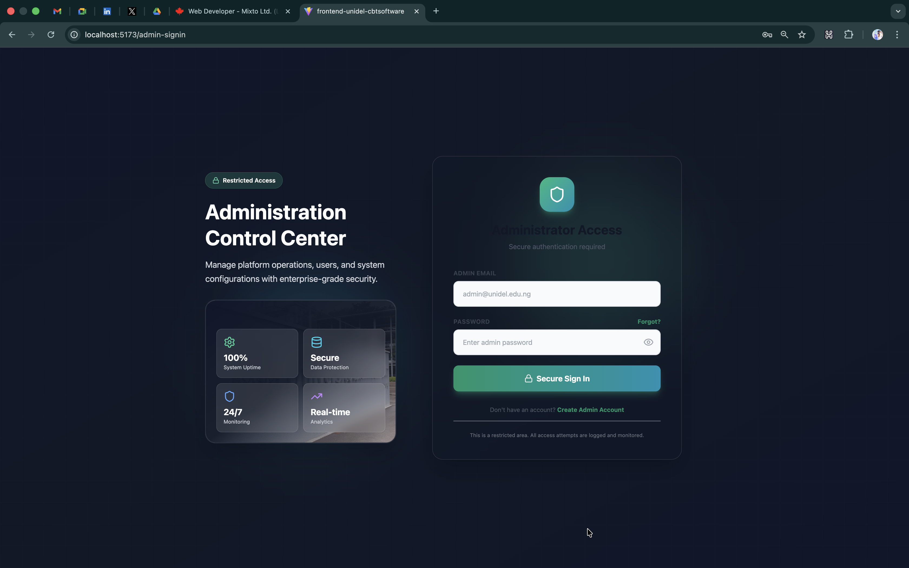
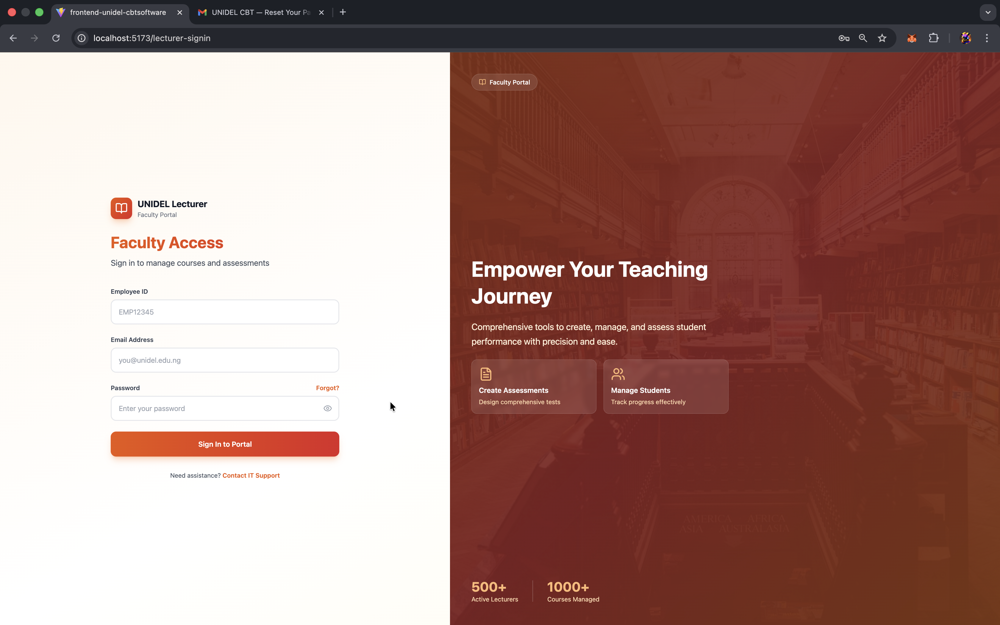
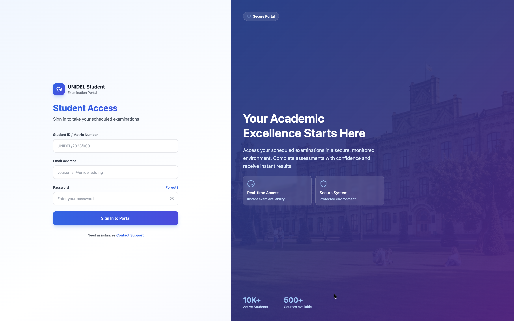
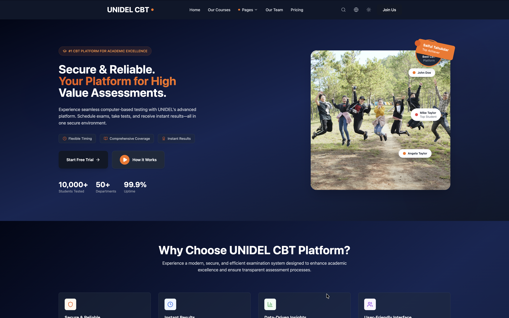
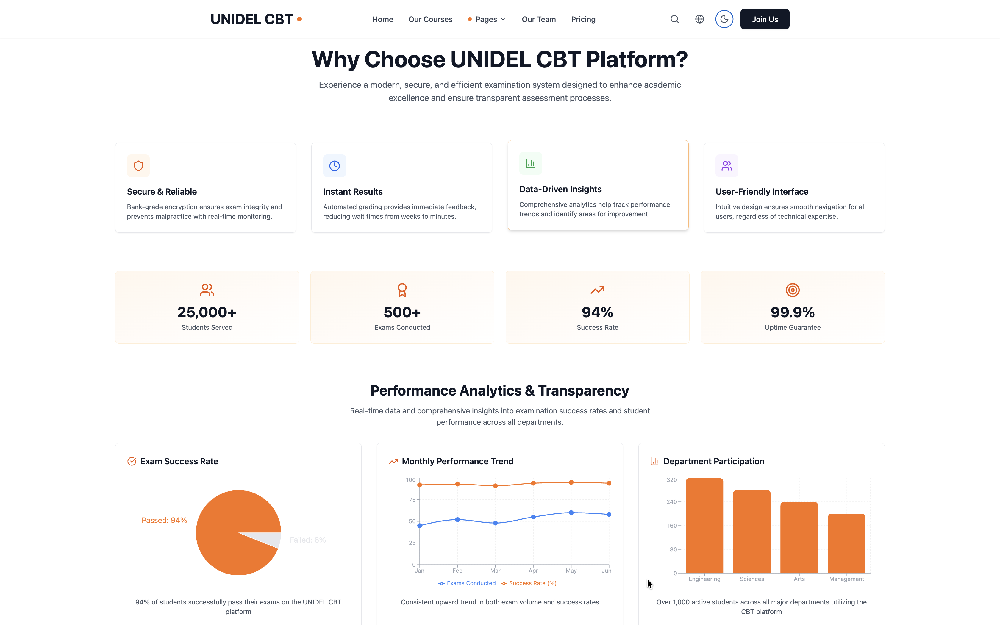
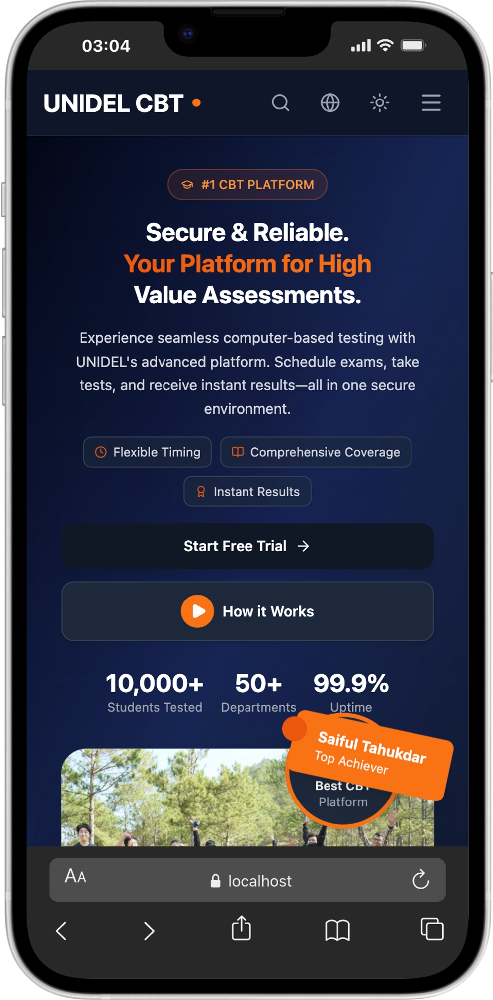
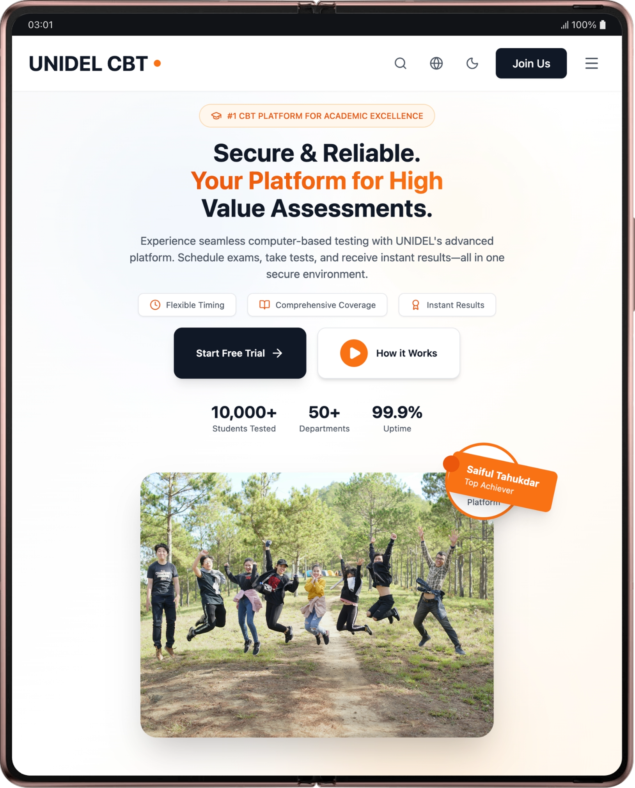

# UNIDEL Computer-Based Test (CBT) System

A robust, enterprise-grade examination management platform built with the MERN stack. Designed specifically for the University of Delta (UNIDEL) to conduct secure, proctored, and automated examinations.

---

## 🌟 Project Overview

The UNIDEL CBT system is a mission-critical application that streamlines the entire examination lifecycle—from question bank creation and AI-assisted generation to real-time proctored exams and automated PDF reporting.

### UI Images

#### Sign-in Pages (3 images)

| Admin Sign-in                                            | Lecturer Sign-in                                               | Student Sign-in                                              |
| -------------------------------------------------------- | -------------------------------------------------------------- | ------------------------------------------------------------ |
|  |  |  |

#### Hero & Charts (2 images)

| Landing Hero                                             | Analytics Charts                                      |
| -------------------------------------------------------- | ----------------------------------------------------- |
|  |  |

#### Mobile & Tablet Views

| Mobile Views                                 | Tablet Views                              |
| :------------------------------------------- | :---------------------------------------- |
|  |  |

---

### Key Features at a Glance

- 🧠 **AI-Powered**: Generate questions and images using HuggingFace AI models.
- 🛡️ **Advanced Proctoring**: Real-time fraud detection with tab-switching, focus-loss, and fullscreen enforcement.
- ⚡ **Auto-Lifecycle**: Scheduled exams that activate and complete automatically via background workers.
- 📊 **Rich Analytics**: Deep-dive dashboards for Admins, Lecturers, and Students with interactive visualizations.
- 📜 **Professional Reports**: Automated generation of branded PDF results, transcripts, and performance analytics.
- 📁 **Cloud Integrated**: Global file storage and optimization via Cloudinary.

---

## Project Structure

This project is organized as a monorepo with two main repositories:

### [Backend-Unidel-CBTsoftware](./Backend-Unidel-CBTsoftware)

- **Tech Stack**: Node.js, Express, MongoDB, Puppeteer, Handlebars.
- **Core Role**: Manages the API, database persistence, exam scheduling, proctoring logic, and PDF rendering.

### [Frontend-Unidel-CBTsoftware](./Frontend-Unidel-CBTsoftware)

- **Tech Stack**: React 18, Vite, TailwindCSS, Zustand, React Query.
- **Core Role**: Provides the interactive user interfaces for students, lecturers, and admins, including the secure exam-taking environment.

---

## Quick Start

Ensure you have **Node.js 18+** and **MongoDB** installed.

1.  **Clone the Repository**:

    ```bash
    git clone https://github.com/unawarexi/Mern-Unidel-CBTsoftware.git
    cd Mern-Unidel-CBTsoftware
    ```

2.  **Setup the Backend**:
    Follow instructions in [Backend README](./Backend-Unidel-CBTsoftware/README.md).

3.  **Setup the Frontend**:
    Follow instructions in [Frontend README](./Frontend-Unidel-CBTsoftware/README.md).

---

## Roadmap & Upcoming Features (TODOs)

- [ ] **Real-time Proctoring (WebSockets)**: Live violation alerts for lecturers during active exams.
- [ ] **Offline-First Mode (PWA)**: Support for exam taking in low-bandwidth or disconnected environments.
- [ ] **Advanced AI Analysis**: Automated grading for essay-based questions using LLMs.
- [ ] **Digital Signatures**: Encrypted digital signatures on all generated academic transcripts.
- [ ] **Performance Virtualization**: Optimizing large-scale data tables for thousands of student records.
- [ ] **Global Search**: A unified command-palette for quick navigation across the entire system.

---

## Contribution & Support

- **Proprietary**: Developed for the **University of Delta (UNIDEL)**.
- **Support**: For technical inquiries, contact [support@unidel.edu.ng](mailto:support@unidel.edu.ng).

---

_Built with ❤️ for UNIDEL Academic Excellence_
